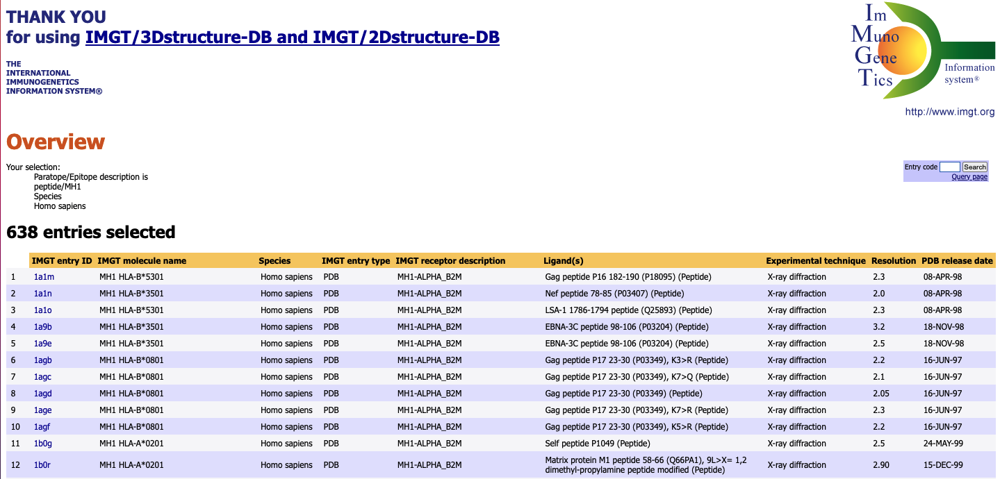
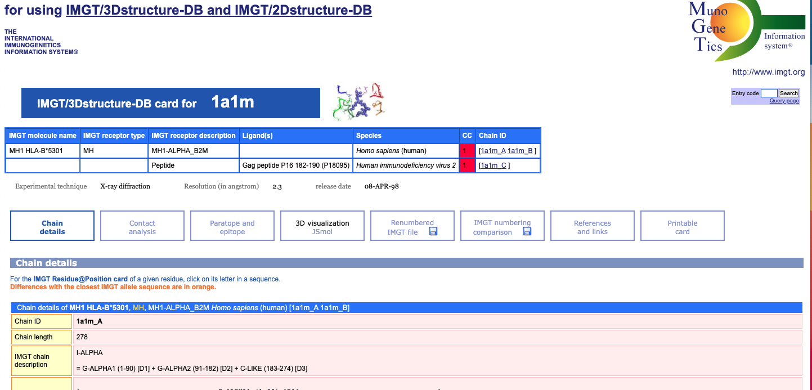
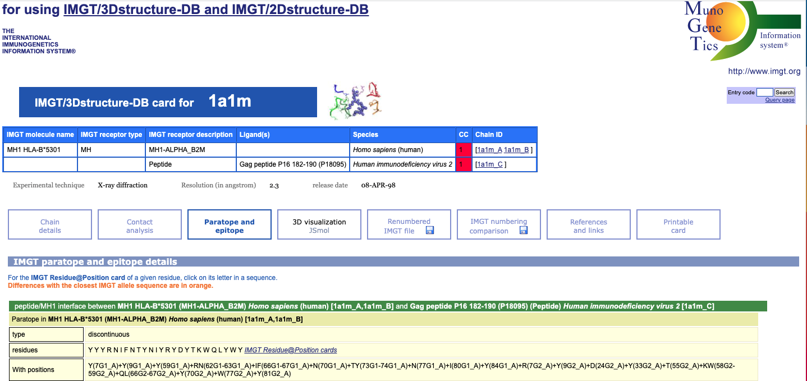

# How did I obtain the paratope information?

I will share how I obtain the paratope information stored in
[hla2paratopeTable_aligned.txt](../data/hla2paratopeTable_aligned.txt) file. 

# Step1: Web-scraping the IMGT 3D database

[IMGT 3D database](http://www.imgt.org/3Dstructure-DB/) contains abundant information on the experimentally solved crystal structure of pMHC1 complex, which can serve as the information source to extract the paratopes informatio (HLA residues that likely to interact with the neoepitope).

In the above link, we selected species as `human` and the type as `pMH1`, click `submit`. You will be directed to a page where all the solved complex structures were listed. When I conduct the project, there were `550` entries in the returned page, now the number has increased.

Let's click any one of the structrure hyperlink:

Then click the "paratope and epitope", where the contacting residues will be shown on the page:

For each HLA, we want to collect all the available contact residues information for each of the experimentally validated paired epitopes.

Now we definitely want to automates this retrieval process, so we use web scraping tool `scrapy` and `selenium`.

The codes and instruction for running the scraper can be found [here](./new_imgt/new_imgt/spiders/new_imgt_spider.py) in this folder. More information I'd like to refer you to the scrapy and selenium official website. You can also use any other alternative ways to retrieve the paratope information.

# Step2: draw consesus paratopes information

We perform a two round clustal-omega runs, the concrete examples are shown in our [Supplemental Figure 1](https://oup.silverchair-cdn.com/oup/backfile/Content_public/Journal/bib/22/6/10.1093_bib_bbab160/1/figures1_bbab160.jpeg?Expires=1641138759&Signature=Dwz-bHr5tow0gf9Fx72KfpW1hqY4W8kjVUMw4H9C-ScW8nm7-lqCchkccq8Q7qRVQihtByvftQc2SejBiT6sufZOfJ8oiPVbo-BruFuy~pnyyh~TsTyE09nD2S~Vfbigx5Ovzi0pYF36~CMDSDRPqaeMiJ5P4R5PzlvZI2clc7UkxGmy2qBPNnUrSh8F~GT2h6jhKjnKAubmTV~Q5hsZCXlzCBkhZnnXMfdBSFIUA3-PgB0sFnu4t~TQ4x7GlMEQecu1s6BTBaP0NLATu17pQrzoMmRP7v3~wLZb7Ew0wkjGc3sALk6bCr19K513RYXsh4jwgBi~GhqYVb2ApVWT7w__&Key-Pair-Id=APKAIE5G5CRDK6RD3PGA).

And the corresponding text descrption can be found in our [Supplemental method](https://oup.silverchair-cdn.com/oup/backfile/Content_public/Journal/bib/22/6/10.1093_bib_bbab160/1/supplemental_methods-r2_bbab160.pdf?Expires=1641138456&Signature=fCDBKmnS-MczQpNrCI7mSqUUdnhG7YruZC~xf-2-MwOJTa8QziioFnnyRjBmivlea-EBX2R76WT0dI45RK-cIMhaCsY7IXtTLD1TJUgk0rPh3m2rHCI8RC2huvDbAw~gC3mqM9pySdio5miLth2yY8Qah7A0SZwxAQa09iOVXN3riJmmCRUrmEKuo55iwJVPCfp9AEGI2uJcOT8HP0jRlOmKObwWZ5SLJXJItJCABqgvR-VR2-zDtL8MXMkwaFASs9qX7sh761fmvSJ-h2p3HDE10cZVT1nYlOxCKah29ybvco7Q7TrbWcarADKmrE3-tnljwr~-30-1rygOWYDUUQ__&Key-Pair-Id=APKAIE5G5CRDK6RD3PGA) from line 36-40.

They should be clear enough, but feel free to contact me if you have any confusions or want to know more about the process.

